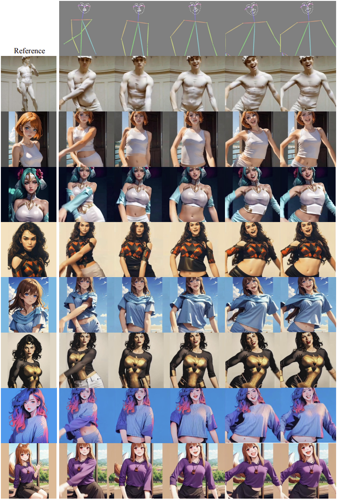
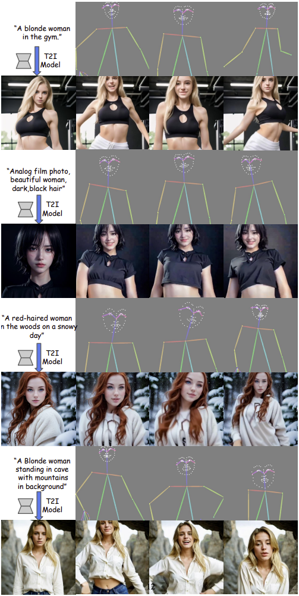
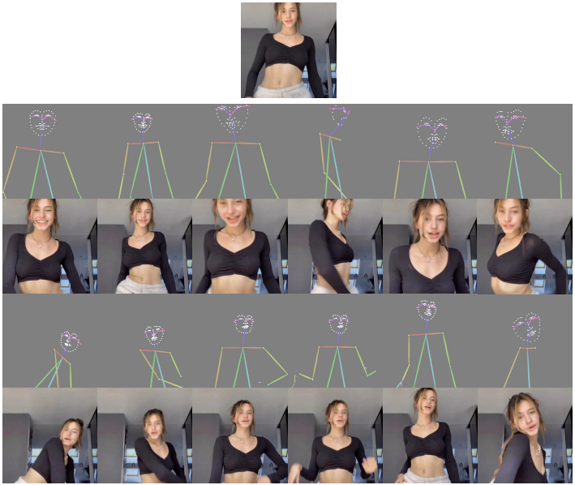

# MagicDance

# Thing to know

1. Connect to A100 GPU runtime
2. Follow the steps and links provided in get started section, download and place all the required file at their places
3. Upload completed(with pretrained models placed) to your gdrive root folder
4. Run all the code blocks in notebook from top to bottom in order
5. Once you installed all the required packages, no need to rerun until youe current run time is closed
6. You can re run from Upload file step to the last step multiple times as required

## Getting Started

For inference on TikTok dataset or your own image and poses, download our MagicDance [checkpoint](https://drive.google.com/drive/folders/1Ny5zkgo3aLVekCJTAga-D_XlMGpR1cj2?usp=sharing).

For appearance control pretraining, please download the pretrained model for [StableDiffusion V1.5](https://huggingface.co/Boese0601/MagicDance/blob/main/control_sd15_ini.ckpt).

For appearance-disentangled Pose Control, please download pretrained [Appearance Control Model](https://drive.google.com/file/d/1oGIxynPhluSjs2rycwQdK4sCx2W_81xE/view?usp=sharing) and pretrained [ControlNet OpenPose](https://huggingface.co/Boese0601/MagicDance/blob/main/control_v11p_sd15_openpose.pth).

The pre-processed TikTok dataset can be downloaded from [here](https://drive.google.com/file/d/1jEK0YJ5AfZZuFNqGGqOtUPFx--TIebT9/view?usp=sharing). OpenPose may fail to detect human pose skeletons for some images, so we will filter those failure cases and train our model on clean data.

Place the pretrained weights and dataset as following:

```bash
MagicDance
|----TikTok-v4
|----pretrained_weights
  |----control_v11p_sd15_openpose.pth
  |----control_sd15_ini.ckpt
  |----model_state-110000.th
  |----model_state-10000.th
|----...
```

## Environment

The environment from my machine is `python==3.9`, `pytorch==1.13.1`, `CUDA==11.7`. You may use other version of these prerequisites according to your local environment.

```bash
conda env create -f environment.yaml
conda activate magicpose
```

### Inference with your own image and pose sequence:

```bash
bash scripts/inference_any_image_pose.sh
```

We offer some images and poses in "example_data", you can easily inference with your own image or pose sequence by replacing the arguments "local_cond_image_path" and "local_pose_path" in inference_any_image_pose.sh. Some interesting outputs from out-of-domain images are shown below:

<div align="center">
  
</div>
Our model is also able to retarget the pose of generated image from T2I model.
<div align="center">
  
</div>

## Inference

### Inference on the test set:

```bash
bash scripts/inference_tiktok_dataset.sh
```

We use exactly same code from [DisCo](https://github.com/Wangt-CN/DisCo) for metrics evaluation. Some example outputs from our model are shown below:

<div align="center">
  
</div>
<br>

## Training

Appearance Control Pretraining:

```bash
bash scripts/appearance_control_pretraining.sh
```

Appearance-Disentangled Pose Control:

```bash
bash scripts/appearance_disentangle_pose_control.sh
```

### Multi-GPU training:

We have already implemented DistributedDataParallel in the python training script. If you want to use multi gpu instead of the first gpu on your machine for traning, see the following script for an example:

```bash
CUDA_VISIBLE_DEVICES=0,1,2,3,4,5,6,7 torchrun --master_port 10000 --nproc_per_node 8 train_tiktok.py \
```

This will use 8 GPUs and run 8 processes(nproc_per_node=8) for training.

## Using your own video data for training

For training on your own dataset, you first need to run [openpose](https://github.com/CMU-Perceptual-Computing-Lab/openpose) for your input images/videos and save the visualized pose map. Then, organize them as the format shown in the TikTok dataset. You can also refer to [DisCo-OpenPose Preprocessing](https://github.com/Wangt-CN/DisCo/blob/main/PREPRO.md#openpose) or [ControlNet-OpenPose](https://github.com/lllyasviel/ControlNet-v1-1-nightly?tab=readme-ov-file#controlnet-11-openpose), we use exactly the same Pose ControlNet in our pipeline.
Then set the path to your data in [dataset/tiktok_video_arnold_copy.py](https://github.com/Boese0601/MagicDance/blob/main/dataset/tiktok_video_arnold_copy.py#L287)

```bash
Your Dataset
|----train_set
  |----video_000
    |----000.jpg
    |----001.jpg
    |----002.jpg
    ...
  |----video_001
  |----video_002
  ...
|----pose_map_train_set
  |----video_000
    |----000.jpg
    |----001.jpg
    |----002.jpg
    ...
  |----video_001
  |----video_002
  ...
|----val_set
|----pose_map_val_set
|----test_set
|----pose_map_test_set
|----...
```

## Some tips

### The task

From our experiences with this project, this motion retargeting task is a data-hungry task. Generation result highly depends on the training data, e.g. the quality of pose tracker, the amount of video sequences and frames per video in your training data. You may consider adopt [DensePose](https://arxiv.org/abs/1802.00434) as in [MagicAnimate](https://arxiv.org/abs/2311.16498), [DWPose](https://github.com/IDEA-Research/DWPose) as in [Animate Anyone](https://arxiv.org/pdf/2311.17117.pdf) or any other geometry control for better generation quality. We have tried [MMPose](https://github.com/open-mmlab/mmpose) as well, which produced slightly better pose detection results. Introduce extra training data will yield better performance, consider using any other real-human dataset half-body/full-body dataset, e.g. [TaiChi](https://github.com/AliaksandrSiarohin/first-order-model)/[DeepFashion](https://mmlab.ie.cuhk.edu.hk/projects/DeepFashion.html), for further finetuning.

### The code

Most of the arguments are self-explanatory in the codes. Several key arguments are explained below.

- `model_config` A relative or absolute folder path to the config file of your model architecture.
- `img_bin_limit` The maximum step for randomly selecting source and target image during training. During inference, the value is set to be "all".
- `control_mode` This argument controls the Image-CFG during inference. "controlnet_important" denotes Image-CFG is used and "balance" means not.
- `wonoise` The reference image is fed into the appearance control model without adding noise.
- `with_text` When "with_text" is given, text is **not** used for training. (I know it's a bit confusing, lol)
- `finetune_control` Finetune Appearance Control Model (and Pose ControlNet).
- `output_dir` A relative or absolute folder for writing checkpoints.
- `local_image_dir` A relative or absolute folder for writing image outputs.
- `image_pretrain_dir` A relative or absolute folder for loading appearance control model checkpoint.
- `pose_pretrain_dir` A relative or absolute path to pose controlnet.
